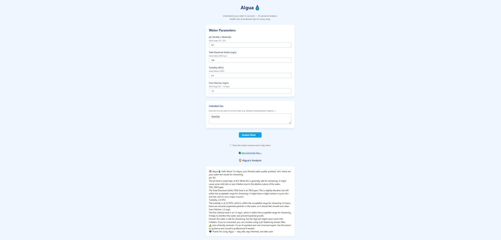
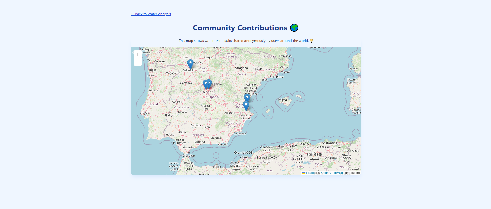

# 💧 AIgua — Your Friendly Water Quality Companion

AIgua is an AI-powered assistant designed to help people easily understand water quality test results. Whether the water is for drinking, cleaning, or irrigation, AIgua provides clear explanations, risk assessments, and treatment suggestions — all with a human tone.

Built as part of the [AI Agent Hackathon with IBM watsonx.ai](https://developer.ibm.com/events/ai-agent-hackathon/), this project supports the UN’s Sustainable Development Goal **#6: Clean Water and Sanitation**.

---

## 📸 Preview

  
*Main interface showing test result input and AI diagnosis.*

  
*Community map showing shared water analyses across regions.*

---

## 🚀 Features

- ✅ Friendly, AI-generated analysis of water test results  
- 💡 Personalized diagnosis based on pH, TDS, turbidity, and free chlorine  
- ⚠️ Risk explanations and treatment suggestions using internal rules + RAG (retrieve-augmented generation)  
- 🌍 Optional map where users can anonymously share their test data  
- 🔐 Safe-by-design — no personal data required  
- 📱 Built with React (frontend) + Python backend + IBM watsonx.ai  

---

## 🧠 How It Works

AIgua combines:
- **Internal rules** for quick evaluation of common parameters  
- **Watsonx.ai + LangChain** to generate friendly, accessible analysis  
- **RAG (Retrieve-Augmented Generation)** for deeper insight using trusted sources (e.g., WHO, EPA)  
- **Firestore** for storing shared anonymous results  
- **React Leaflet** for map visualization  

---

## 🏗 Tech Stack

| Layer         | Tech                              |
|---------------|-----------------------------------|
| Frontend      | React + TypeScript + Vite         |
| Backend       | Python + LangChain + FastAPI |
| AI Model      | IBM watsonx.ai (Granite model)    |
| Retrieval     | Custom RAG pipeline with LangChain |
| Map & DB      | React Leaflet + Firebase Firestore |
| Styling       | Tailwind CSS                      |

---

## 📦 Installation

### 🔧 Prerequisites

- Node.js + npm  
- Python 3.10+  
- Firebase account (for map and shared data)  
- IBM Cloud + watsonx.ai access  

---

### 💻 Frontend Setup

```bash
cd waterbuddy-frontend
npm install
npm run dev
```

> The frontend will run at `http://localhost:5173`

---

### ⚙️ Backend Setup

```bash
cd waterbuddy-backend
python -m venv venv
source venv/bin/activate  # or venv\Scripts\activate on Windows
pip install -r requirements.txt
python main.py
```

> Make sure to configure your `credentials.py` with IBM and Firebase settings.

---

## 🧪 Sample Input

```json
{
  "pH": 7.2,
  "TDS": 650,
  "turbidity": 3.0,
  "free_chlorine": 0.15,
  "usage": "watering vegetables"
}
```

---

## 🌐 Live Demo

[](https://www.youtube.com/watch?v=kAa69mZ3UZk)

---

## 🤝 Contributing

We welcome contributions! To get started:

1. Fork the repo  
2. Create a new branch (`git checkout -b feature-name`)  
3. Commit your changes (`git commit -m 'Add feature'`)  
4. Push to the branch (`git push origin feature-name`)  
5. Create a Pull Request  

---

## 🎯 Hackathon Info

This project was developed as part of the **AI Agent Hackathon with IBM watsonx.ai**, focusing on SDG 6: Clean Water and Sanitation.

### 👥 Team

- **Alex Quilis Vila**
  [LinkedIn](https://www.linkedin.com/in/alex-quilis-vila/)
  
- **Junjie Wu**
  [LinkedIn](https://www.linkedin.com/in/junjie-wu-jj/)  

---

## 📄 License

This project is **not open-source** and is shared under a custom license.  
You may use it for personal or educational purposes only, with proper attribution.  
Commercial use, redistribution, or modification is **not allowed** without permission.

See the [LICENSE](./LICENSE.md) file for full terms.

---

## 💙 Special Thanks

- IBM & Call for Code team  
- LangChain & open-source agentic frameworks  
- World Health Organization (WHO) & EPA for open guidelines  

---

> “Water is life. Let’s make sure it’s safe for everyone.”
